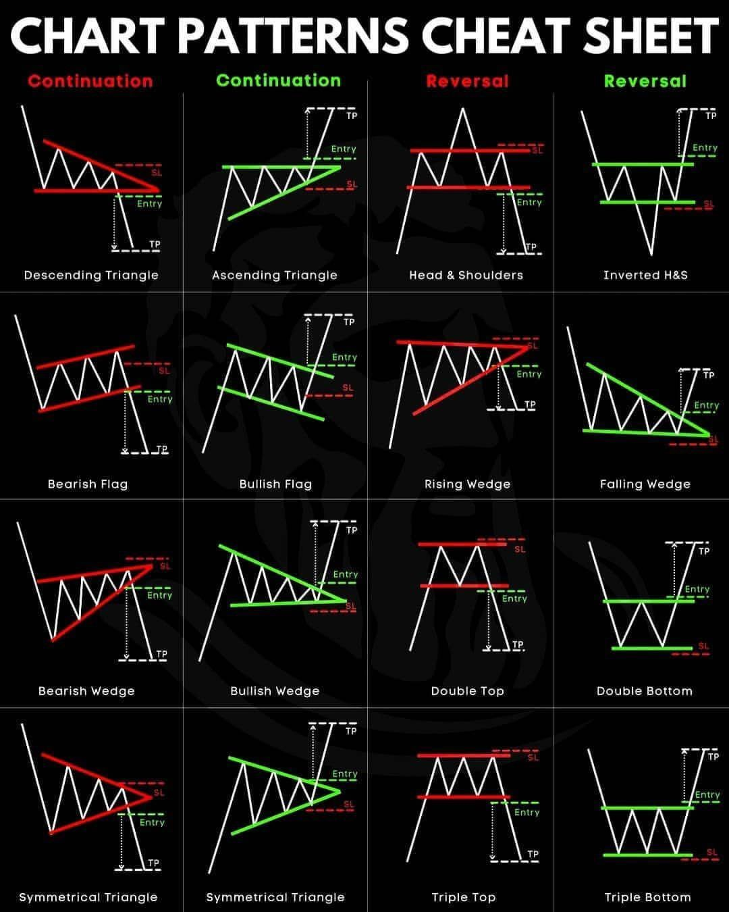

# Trading pattern

# Introduction

[https://github.com/vietphan1995/trade-pattern.git](https://github.com/vietphan1995/trade-pattern.git)

Trading pattern is a management software that helps you aware your trading progress.

Trading pattern provides sending trading information notification through many personal digital channels, the information can be listed as current information from market, daily information report, condition matching.

Trading pattern helps people create many rules, conditions that if market indicator match, your design information will be sent to your digital box like email, phone message, in application, social platforms …

Trading pattern supports many matching conditions by interval time, market pattern, trading campaign, plotting, querying in automation, artificial intelligence.

Trading pattern supports many variety trading markets like stock, bond, property, betting, …

Trading pattern supports traceback, history functions in market.

[back to projects …](https://github.com/vietphan1995/projects)

### Notes
https://phantrungviet.notion.site/Trading-pattern-1b25e832d6ee8051a23cd7cf378ba4b5